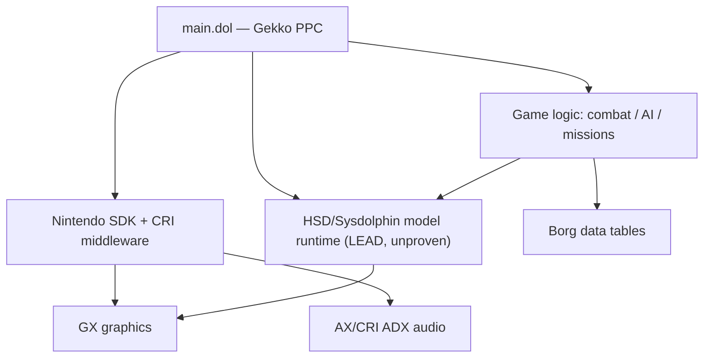
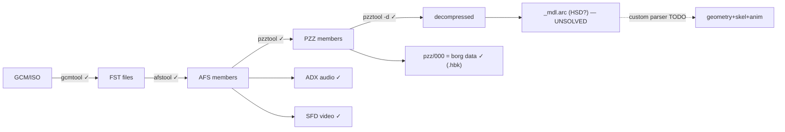
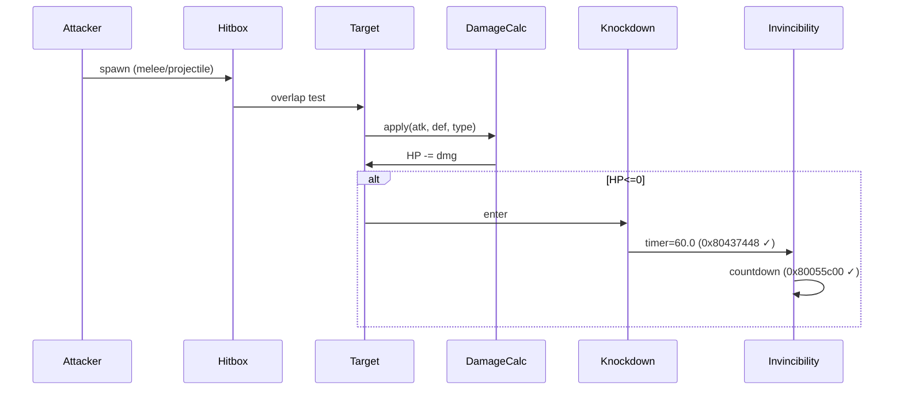
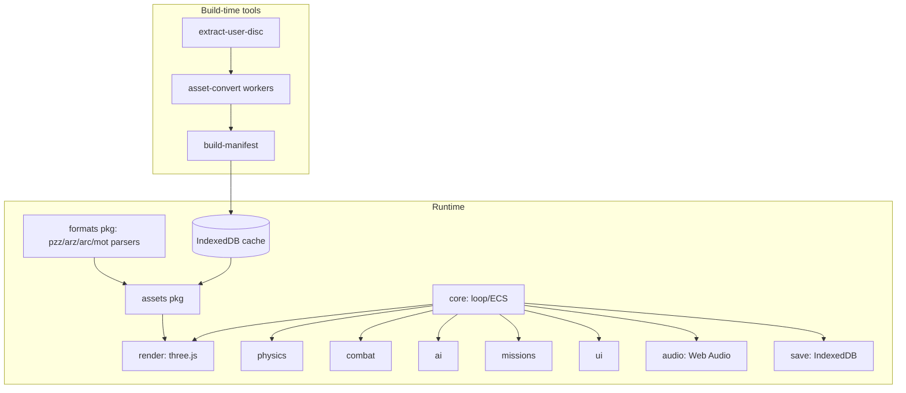

# Gotcha Force / ガチャフォース (GameCube) — Phase-0 Technical Research & Browser-Recreation Plan

> **Status:** Known as of research date **2026-06-30**. Never "complete."
> **Scope:** Technical only. Legal/clean-room intentionally omitted per project direction (direct asset extraction + reuse of MIT-licensed tool code assumed acceptable for this personal project).
> **Confidence labels:** Confirmed (directly verified, 3-0 adversarial vote) / Likely (multiple clues) / Speculative / Unknown.
> **Region discipline:** NTSC-J = **GG4J**, NTSC-U = **GG4E**, PAL = **GG4P**. Addresses/hashes/layouts are kept per-region and never merged.

Provenance note: every "Confirmed" item below was extracted from a primary source and survived a 3-vote adversarial verification pass. Engineering-design sections (architecture, roadmap, repo layout, recreation choices — outputs 9–16) are **design recommendations / inference**, not research findings, and are labeled as such.

---

## 1. Executive summary

The decisive finding: **Gotcha Force's outer and mid-layer formats are already solved; the 3D model/skeleton/animation format is the one unsolved blocker, and it is globally open — no parser exists anywhere.** Everything else either has a working tool or yields to generic GameCube/CRI tooling.

| Layer | State | Anchor |
|---|---|---|
| Disc (GCM/ISO), AFS, **PZZ + ARZ**, MDT text, MOT (container) | **Solved** | NeoGF (MIT, Python 3) — Confirmed |
| AFS (second independent impl) | **Solved** | RenolY2 `gotcha-afs-tool` (tested on GC) — Confirmed |
| Audio (CRI ADX, incl. encrypted-key brute force), SFD video demux | **Solved** | hcs64 / vgmstream / `sfd2mpg` — Confirmed |
| Executable analysis | **Not greenfield** | NeoGF `GG4E-CSM-20220412.map` + NicholasMoser addresses — Confirmed |
| Browser runtime for glTF/GLB + KTX2 | **Available** | three.js `GLTFLoader` + `KTX2Loader` — Confirmed |
| **Model / material / skeleton / animation** (geometry inside `pzz`, `_mdl.arc`, and the `chd/dpk/tsb/txg` family) | **UNSOLVED — critical path** | No parser anywhere — Confirmed gap |

The model container is **identified** (not decoded) on the NeoGF RE wiki as `ARC = "HSD Files"` (HAL Sysdolphin lineage; `_mdl.arc` naming such as `deck00_mdl.arc`, `box00_mdl.arc`). This is a **research lead, not a shortcut**: the stronger claim that the HSD engine is *statically linked into `boot.dol`* (which would make HSDLib/Melee tooling directly applicable) was **refuted 0-3**. Treat HSD as a hypothesis to test against `plxxxx.pzz/000` and `_mdl.arc`, not an established path. **(Confirmed identification; the static-link shortcut is Refuted.)**

Practical consequence for the roadmap: ~70% of the asset pipeline is plumbing you can stand up immediately with existing tools; the project's risk and timeline are dominated by one task — reverse-engineering the model/animation format from scratch (or proving the HSD lead). Plan accordingly.

---

## 2. Source matrix

robots = blocked from automated fetch, must be read manually in a browser. **Compute no hashes from these — none were verified here.**

| Source | URL | Type | Last activity (approx.) | Maintainer | What it proves | Formats/Tools | Region | Confidence | Follow-up |
|---|---|---|---|---|---|---|---|---|---|
| **NeoGF** | github.com/Virtual-World-RE/NeoGF | Primary repo (MIT, Py3) | active | Virtual-World-RE | Canonical toolset; one tool per solved layer; **no** model parser | gcmtool, afstool, pzztool(+ARZ), mdttool, mottool, doltool | all | **Confirmed** | Clone; read each `*/README.md` |
| NeoGF `data/README.md` + `data/` | github.com/Virtual-World-RE/NeoGF/blob/main/data/README.md | Primary | — | Virtual-World-RE | Symbol map + borg-data bookmarks exist; `plxxxx.pzz/000` mirrors `plxxxxdata.bin` | `GG4E-CSM-20220412.map`, `GF_NTSC-plxxxxdata.bin.hbk`, `NTSC_Borgs.csv`, `eu_borgs_GET_values.csv` | GG4E (+EU csv) | **Confirmed** | Pull map into Ghidra/Dolphin |
| **NeoGF RE wiki** | wiki.re.virtualworld.fr/index.php/Gotcha_Force | Primary wiki | — | Virtual-World-RE | `ARC = HSD Files`; file-format table; GET system | format specs | all | **Confirmed (robots)** | **Read manually**; transcribe to `research/format-specs/` |
| NeoGF Gitea mirror | git.virtualworld.fr/Virtual-World-RE | Self-hosted mirror | — | Virtual-World-RE | Backup of org | — | all | Likely | **Archive it** (self-hosted infra disappears) |
| **NicholasMoser/GotchaForce** | github.com/NicholasMoser/GotchaForce | Primary repo | — | N. Moser | Region-tagged gameplay addresses; RE workflow | Dolphin/Ghidra notes | **GG4E + GG4P** | **Confirmed** | Mine every address; tag region |
| Naruto-GNT-Modding docs | github.com/NicholasMoser/Naruto-GNT-Modding (`finding_memory.md`, `symbol_maps.md`) | Primary docs | — | N. Moser | Reproducible memory→Ghidra workflow; `.map` load procedure | Dolphin Memory Engine, Ghidra | generic GC | **Confirmed** | Use as the RE SOP |
| RenolY2 gotcha-afs-tool | github.com/RenolY2/gotcha-afs-tool | Primary repo (Py3) | — | RenolY2 (Yoshi2) | AFS unpack/repack, **tested on GC** (author self-report) | AFS | GC | **Confirmed** | Cross-check vs afstool |
| spriters-resource / vg-resource | models.spriters-resource.com/gamecube/gotchaforce/ ; archive.vg-resource.com/thread-36616.html ; vg-resource.com/thread-21266.html | Forum | 2020–2021 | community | AFS extraction works; **models are the unsolved blocker** stuck in arc/arz/chd/dpk/mdt/pzz/tpl/tsb/txg; "Capcom Made in Japan" texture stamps | — | — | **Confirmed (gap)** | Mine for partial format notes |
| GCFT | github.com/LagoLunatic/GCFT | Primary tool | active | LagoLunatic | Generic GC multitool covers GCM/RARC/BTI/J3D/JPC/Yaz0/Yay0/BMG — **none of GF's inner formats** | standard Nintendo | generic | **Confirmed** | Use only for disc-level GCM |
| decomp-toolkit | github.com/encounter/decomp-toolkit | Primary tool | active | encounter | DOL/ELF/REL/RSO + CodeWarrior `.map` | DOL analysis | generic | **Confirmed** | Apply to each region's main.dol |
| MaikelChan AFSPacker/AFSLib | github.com/MaikelChan/AFSPacker | Primary tool (.NET) | active | MaikelChan | Generic AFS extract/create | AFS | generic | **Confirmed** | Backup AFS path |
| hcs64 vgm_ripping | hcs64.com/vgm_ripping.html ; github.com/hcs64/vgm_ripping | Primary | — | hcs64 | ADX solved (degod/guessadx brute-force key); SFD→`sfd2mpg` | ADX, SFD | generic | **Confirmed** | Wire into audio pipeline |
| three.js GLTFLoader / KTX2Loader | threejs.org/docs/pages/GLTFLoader.html ; .../KTX2Loader.html | Primary docs | active | three.js | glTF 2.0 + KTX2/Basis runtime confirmed | runtime | n/a | **Confirmed** | Baseline renderer |
| NeoGF-Editor / HSDLib | github.com/Virtual-World-RE/NeoGF-Editor ; github.com/Virtual-World-RE/HSDLib | Primary (Java) | — | Virtual-World-RE | "GF + HSD Engine" editor; HSD library | HSD | — | **Speculative (applicability)** | Test against `_mdl.arc`; do **not** assume it works |
| JP wikis | wikiwiki.jp/gotcha/ ; seesaawiki.jp/w/gotchaforce/ | Forum wiki | active | community | Borg stats incl. GF-energy cost values (e.g. 並ボーグ Kung Fu Master cost 260) | gameplay data | GG4J | Likely | Source of truth for stats/economy |
| Fandom (EN) | gotchaforce.fandom.com/wiki/Gotcha_Force_Wiki | Forum wiki | active | community | EN borg stats, story, collection rules | gameplay data | mixed | Likely | Cross-ref JP wikis |
| JP Wikipedia | ja.wikipedia.org/wiki/ガチャフォース | Secondary | active | — | Release dates, regional codes | — | all | Likely | Date minutiae only |

**Negative result (Confirmed):** the Japanese scene is cheat-code / strategy-wiki oriented — extensive PAR/AR code lists, **no JP model/format tool**. The model-format gap is global.

---

## 3. Tool-support matrix

| Tool | Layer | Status | GF-specific? | Depend on it? |
|---|---|---|---|---|
| NeoGF `gcmtool` | Disc GCM/ISO | Working | Yes | Yes (disc unpack) |
| NeoGF `afstool` | AFS | Working | Yes | Yes |
| NeoGF `pzztool` | PZZ archive **+ ARZ decompress** | Working | Yes | **Yes (central)** |
| NeoGF `mdttool` | MDT text | Working | Yes | Yes (text) |
| NeoGF `mottool` | MOT animation container | **Partial — "not fully implemented"; container-level only, no bones/keyframes** | Yes | Partial |
| NeoGF `doltool` | DOL | Working | Yes | Yes |
| NeoGF `GG4E-CSM-20220412.map` | DOL symbols | Working (USA) | Yes | Yes (seed symbols) |
| RenolY2 `gotcha-afs-tool` | AFS | Working (tested on GC, self-report) | Yes | Optional (cross-check) |
| MaikelChan AFSPacker/AFSLib | AFS | Working | No | Optional fallback |
| decomp-toolkit | DOL/ELF/REL/RSO + map | Working | No | Yes (exe analysis) |
| GCFT | GCM + standard Nintendo formats | Working but **does not parse GF inner formats** | No | No |
| Dolphin + Memory Engine | runtime RE | Working | No | Yes (gameplay RE) |
| Ghidra + GC loader | static RE | Working | No | Yes |
| degod / guessadx / vgmstream | ADX audio | Working (incl. key brute-force) | No | Yes (audio) |
| bero `sfd2mpg` | SFD video demux | Working | No | Yes (video) |
| three.js `GLTFLoader` / `KTX2Loader` | browser runtime | Working | No | Yes (render) |
| NeoGF-Editor / HSDLib | HSD models | **Unproven on GF** | partial | **No — test first** |
| **Model/skeleton/anim parser** | geometry | **DOES NOT EXIST** | — | **Must build** |

---

## 4. File-format table

Endianness for GameCube is **big-endian** unless proven otherwise (PowerPC Gekko). Magic/headers marked Unknown were not verified in this pass.

| Ext | Example | Container? | Purpose | Compression | Endian | Magic/header | Existing parser | Maturity | Export target | Confidence | Notes |
|---|---|---|---|---|---|---|---|---|---|---|---|
| `afs` | `*.afs` | Yes | Top-level archive (CRI) | None | LE table* | `AFS\0` | NeoGF afstool; RenolY2; AFSPacker | Mature | unpack to members | **Confirmed** | *AFS TOC commonly little-endian; verify per file |
| `pzz` | `plxxxx.pzz` | Yes | GF archive of members; member `000` = borg data clone | Per-member (ARZ) | BE | Unknown (size table) | NeoGF pzztool | Mature | members | **Confirmed** | Entry point for borg data + models |
| `arz` | inside `pzz` | No | LZ-style compressed blob | Yes (LZ) | BE | Unknown | NeoGF pzztool (`-d`) | Mature | raw bytes | **Confirmed** | Decompress = solved |
| `arc` | `deck00_mdl.arc` | Yes | **Model archive — "HSD Files"** | Unknown | BE | Unknown | none (HSDLib unproven) | **None** | → glTF (goal) | **Likely (ID) / Unknown (parse)** | **Critical path** |
| `chd` | `*.chd` | ? | Unknown (model/scene?) | Unknown | BE | Unknown | none | **None** | TBD | **Unknown** | Open |
| `dpk` | `*.dpk` | ? | Unknown (pack?) | Unknown | BE | Unknown | none | **None** | TBD | **Unknown** | Open |
| `mdt` | `*.mdt` | Yes | Text **and** possibly model-adjacent data | Unknown | BE | Unknown | NeoGF mdttool (text) | Partial | JSON (text) | **Likely** | Text solved; non-text payload unknown |
| `mot` | `*.mot` | Yes | Animation (motion) | Unknown | BE | Unknown | NeoGF mottool (container only) | **Partial** | → glTF anim (goal) | **Likely** | No keyframe parse yet |
| `tpl` | `*.tpl` | Yes | **Standard GC texture palette** | None/CMPR | BE | TPL header | generic GC tools | Mature | PNG/KTX2 | **Likely** | Standard format — should yield |
| `tsb` | `*.tsb` | ? | Unknown (scene/skeleton?) | Unknown | BE | Unknown | none | **None** | TBD | **Unknown** | Open |
| `txg` | `*.txg` | ? | Unknown (**texture group?** — "Capcom Made in Japan" stamps seen on GF textures) | Unknown | BE | Unknown | none | **None** | PNG/KTX2 (goal) | **Speculative** | Likely texture container |
| `bin` | `plxxxxdata(2/3).bin` | No | Borg data tables | None | BE | n/a | HexWorkshop bookmarks (`*.hbk`) | Mature (layout) | JSON | **Confirmed** | Same layout as `pzz/000` |
| `adx` | `*.adx` | No | CRI ADX audio | ADPCM | BE | `(0x80 00)` ADX | degod/vgmstream | Mature | OGG/Opus | **Confirmed** | Incl. encrypted-key brute force |
| `sfd` | `*.sfd` | Yes | Sofdec MPEG video | MPEG | — | Sofdec | `sfd2mpg` | Mature | demux→re-encode | **Confirmed** | Use sfd2mpg, **not** adXtract |
| `gci` | `*.gci` | Yes | GC memory-card save | None | BE | GCI header | generic GC save tools | Mature | JSON | **Likely** | Save schema = separate RE |

---

## 5. Disc / file structure — exact local commands per region (compute your own; **no fabricated hashes**)

You must run these against **your own dump** for each region you own. Disc IDs: **GG4E** (USA), **GG4J** (Japan), **GG4P** (PAL); GameTDB product codes `GG4E08 / GG4J08 / GG4P08` (Confirmed). Release dates: GG4J 2003-11-27, GG4E 2003-12-03 (Wikipedia says Dec 5 — non-load-bearing), GG4P 2004-02-20 (Confirmed; date minutiae Likely).

```bash
# --- 1. Hashes (DO THIS FIRST, per region; record in research/disc/<REGION>.hashes) ---
sha1sum  GotchaForce_<REGION>.iso
md5sum   GotchaForce_<REGION>.iso
crc32    GotchaForce_<REGION>.iso        # or: rhash --crc32

# --- 2. Header / Disc ID (first 0x20 bytes: 4-char game code at offset 0) ---
xxd -l 0x20 GotchaForce_<REGION>.iso     # confirm GG4E / GG4J / GG4P

# --- 3. Unpack disc with NeoGF gcmtool (preferred — GF-aware) ---
python gcmtool.py -u GotchaForce_<REGION>.iso ./extract_<REGION>

# Alt with nod or wit:
#   nod extract GotchaForce_<REGION>.iso ./extract_<REGION>
#   wit EXTRACT GotchaForce_<REGION>.iso --DEST ./extract_<REGION>

# --- 4. Inspect sys/ ---
ls -l ./extract_<REGION>/sys/            # boot.bin, bi2.bin, apploader.img, main.dol
sha1sum ./extract_<REGION>/sys/main.dol  # record per region — DOLs differ across regions

# --- 5. FST tree + file counts by extension ---
find ./extract_<REGION>/files -type f | sed 's/.*\.//' | sort | uniq -c | sort -rn

# --- 6. Magic-byte sniff across inner files ---
for f in $(find ./extract_<REGION>/files -type f); do printf '%s: ' "$f"; xxd -l 8 "$f" | head -1; done > research/disc/<REGION>.magic.txt

# --- 7. DOL analysis with decomp-toolkit ---
dtk dol info ./extract_<REGION>/sys/main.dol
dtk dol split ./extract_<REGION>/sys/main.dol --map GG4E-CSM-20220412.map   # USA only; JP/PAL maps must be re-derived
```

**Unknown until you run it:** exact SHA-1/MD5/CRC32, FST tree, `main.dol` size/offsets, per-extension file counts. The community symbol map exists **only for GG4E**; **JP/PAL symbol maps must be re-derived** (the wake-up-invincibility example proves addresses shift between regions).

---

## 6. Executable-analysis findings + next steps

**Order of operations (Confirmed workflow):** load the community symbol map → identify SDK/CRI library functions first → only then name game functions → keep a provenance-tagged symbol DB.

**Known addresses (region-tagged, Confirmed):**

| System | Region | Address | Meaning | Source |
|---|---|---|---|---|
| Wake-up invincibility — init | GG4E | `0x8005d4b0` | sets timer to float 60.0 | NicholasMoser |
| " — also set | GG4E | `0x8005c7d8` | secondary init | NicholasMoser |
| " — static constant | GG4E | `0x80437448` | 60.0 float literal | NicholasMoser; Gecko `04437448 00000000` |
| " — countdown | GG4E | `0x80055c00` | decrements timer | NicholasMoser |
| " — static constant | **GG4P** | `0x804440a8` | same 60.0 float, **PAL** | NicholasMoser Gecko `04440aa8` |

**Memory map (Likely / standard GC):** code+data load at fixed `0x8000_0000+` (MEM1, 24 MB), so runtime↔Ghidra addresses map 1:1 — a halted Dolphin breakpoint address pastes straight into Ghidra `G`.

**Reproducible loop (Confirmed):**
1. Dolphin Memory Engine (or Cheats Search): Unknown-initial-value → iterative Next-Scan on value-change conditions → narrow to a few addresses.
2. Set read/write breakpoint on the address.
3. On halt: "Copy address" → Ghidra `G` → paste → read decompiled function.
4. Load symbols: Dolphin `File ▸ Open User Folder ▸ Maps`, drop `GG4E.map` (Game-ID-named), then `Symbols ▸ Load Symbol Map`. Names appear in Code view, callstacks, debugger.

**Symbol-DB provenance convention (Confirmed from `data/README.md`):** `gnt4-` = verified from doldecomp; unprefixed = from Dolphin `.dsy` signatures (lower trust); **new symbols get an `abc-` style prefix**. Keep this discipline.

**Struct hypotheses (Speculative — to verify):**
- Borg-data record: fixed-stride table in `plxxxxdata.bin` / `plxxxx.pzz/000`; use the `.hbk` HexWorkshop bookmarks to recover field offsets (stats, GF-energy cost, GET values).
- Active-borg runtime struct: contains the invincibility timer (offset relative to a base pointer set near `0x8005d4b0`); the base is your handle to HP/state/position fields.

**Unknown-systems list (next breakpoints to set):** flight/dash velocity, target-lock pointer, projectile-tracking table, damage-calc routine, AI state machine, borg-switch routine, GET/gacha RNG, 2000-borg storage array, data-crystal counter, mission-progression flags, save serialization.

---

## 7. Asset-recovery plan (per class)

Export targets: **glTF/GLB** (models+anims), **PNG/WebP/KTX2** (textures), **OGG/Opus** (audio), **JSON** (data).

| Asset class | Source files | Existing tool | Difficulty | Custom parser? | Validation | Export | Browser runtime | Confidence |
|---|---|---|---|---|---|---|---|---|
| **Borg models** | `*_mdl.arc`, `plxxxx.pzz` | none (HSDLib unproven) | **Very hard** | **Yes (the project)** | render vs Dolphin screenshot | glTF/GLB | GLTFLoader | **Unknown** |
| **Skeletons** | same | none | **Very hard** | Yes | bind-pose vs in-game | glTF skin | three.js Skeleton | **Unknown** |
| **Weights** | same | none | **Very hard** | Yes | deform vs in-game | glTF | — | **Unknown** |
| **Animations** | `*.mot` | mottool (container only) | Hard | Yes (keyframes) | playback vs in-game | glTF anim | AnimationClip | **Speculative** |
| **Textures** | `*.tpl`, `*.txg` | TPL: generic; TXG: none | Med (TPL) / Hard (TXG) | TXG yes | visual diff | PNG→KTX2 | KTX2Loader | **Likely (TPL)** |
| **Materials** | `*.arc`/`*.chd`/`*.tsb`? | none | Hard | Yes | shading diff | glTF PBR approx | — | **Unknown** |
| **UI** | `*.tpl`, layout `*.bin` | partial | Med | maybe | visual | PNG+JSON | DOM/canvas | **Speculative** |
| **Audio (BGM/SFX)** | `*.adx`, `*.afs` | degod/vgmstream | Easy | No | A/B listen | OGG/Opus | Web Audio | **Confirmed** |
| **Voice** | `*.adx` | vgmstream | Easy | No | listen | OGG/Opus | Web Audio | **Confirmed** |
| **SFD movies** | `*.sfd` | `sfd2mpg` | Easy | No | playback | demux→WebM/MP4 | `<video>` | **Confirmed** |
| **Arenas/stages** | `*.arc`/`*.chd`/`*.tsb`? | none | Very hard | Yes | render diff | glTF | GLTFLoader | **Unknown** |
| **Collision** | unknown | none | Hard | Yes | physics match | JSON mesh | physics pkg | **Unknown** |
| **Mission data** | `*.bin`/`*.mdt` | mdttool (text) | Med | Yes (binary) | playthrough | JSON | missions pkg | **Speculative** |
| **Borg stats** | `plxxxxdata.bin`, `pzz/000` | `.hbk` bookmarks | Med | Yes (table) | vs JP wiki + `NTSC_Borgs.csv` | JSON | combat pkg | **Likely** |
| **AI** | DOL | Ghidra | Very hard | RE, not extract | behavior match | code→TS | ai pkg | **Unknown** |
| **Save** | `*.gci` | generic GC save | Med | Yes (schema) | round-trip | JSON | IndexedDB | **Likely** |
| **Gacha/shop tables** | `*.bin`/DOL | none | Med | Yes | vs wiki (2000 borg / 1000 crystal caps) | JSON | missions pkg | **Speculative** |

---

## 8. Gameplay-systems RE plan (per system)

Fidelity: **exact** = must match original numbers; **close** = feel-equivalent; **inspired-by** = approximate.

| System | Known behavior | Evidence | Candidate vars/funcs | Region diffs | Experiment | Browser approx | Fidelity |
|---|---|---|---|---|---|---|---|
| Movement / flight / dash | 3D flight, dash, hover | gameplay (Likely) | velocity struct near active-borg base | addresses shift | DME scan speed while moving | fixed-dt integrator | **close** |
| Combat / damage | melee+ranged, HP pools | wiki stats (Likely) | damage-calc routine | likely shifts | breakpoint on HP write | formula port | **exact** (stats) / **close** (feel) |
| **Wake-up invincibility** | timer = 60.0 frames after knockdown, counts down | **Confirmed** addresses | `0x80437448` etc. | **proven shift** (GG4E vs GG4P) | already documented | direct port | **exact** |
| Borg switching | swap active borg from force | gameplay (Likely) | borg-switch routine | shifts | breakpoint on active-index write | state swap | **close** |
| Force composition | build force under GF-energy budget | wiki (Likely) | cost table in borg data | — | read `pzz/000` costs | JSON rules | **exact** |
| Target lock | lock-on nearest/aimed | gameplay (Speculative) | target pointer | shifts | scan locked-target ptr | nearest-in-cone | **close** |
| AI states | per-borg behaviors | gameplay (Unknown) | AI state machine in DOL | shifts | Ghidra trace | behavior tree | **inspired-by** |
| Projectile tracking | homing/aimed shots | gameplay (Speculative) | projectile table | shifts | breakpoint on spawn | per-type steering | **close** |
| Cooldowns | per-attack timers | gameplay (Speculative) | timer fields | shifts | scan timers | timer map | **close** |
| Hitstun / knockdown | stun→knockdown→wake | **partial Confirmed** (ties to invincibility) | stun/knockdown timers | shifts | breakpoint chain from invincibility | state machine | **close** |
| Camera | follow/lock camera | gameplay (Unknown) | camera struct | shifts | scan cam pos | three.js cam rig | **inspired-by** |
| Particles | hit/charge FX | gameplay (Unknown) | FX system | shifts | RenderDoc capture | sprite/GPU FX | **inspired-by** |
| Mission progression | story + unlocks | wiki + save (Likely) | progression flags | shifts | scan flags on win | JSON state machine | **close** |
| Unlock / shop / **gacha** | GET system; 2000-borg / 1000-crystal caps | wiki (Likely) + RE wiki GET section | GET RNG + counters | shifts | breakpoint on crystal counter | weighted RNG | **exact** (caps) / **close** (rates) |
| Save | borg collection + progress | `*.gci` (Likely) | save serializer | shifts | round-trip a save | JSON↔IndexedDB | **exact** (data) |

> The RE wiki's **`Implementations#Borgs_GET_system`** section (robots-blocked) is the highest-value transcribe target for the gacha/GET economy — read it manually first.

---

## 9. Engine-architecture reconstruction (Mermaid)

> Diagrams are **reconstruction hypotheses** (Likely/Speculative) except where they restate Confirmed format facts.

**Runtime dependency (hypothesis):**


**Asset-loading pipeline (mix of Confirmed + hypothesis):**


**Combat damage sequence (hypothesis):**


**Borg-switching flow & mission progression:** standard state machines — `force[] → activeIndex → swap → spawn model → bind input`; `mission → win/lose → flags → unlock/GET → save`. (Speculative; verify via breakpoints.)

---

## 10. Browser-recreation architecture (design recommendation)

TypeScript + Vite. Three.js baseline renderer (broadest glTF/KTX2 support, Confirmed loaders); keep a WebGPU path behind a flag for later. WASM only for hot parsers; Web Workers for offline asset conversion; Web Audio for ADX-derived OGG/Opus; IndexedDB asset cache keyed by disc hash.



Packages: `core, assets, formats, render, physics, combat, ai, missions, ui, audio, save, tools, test-fixtures`.

---

## 11. AI-assisted RE workflow

Ghidra (+GC loader) and Dolphin debugger are the spine; decomp-toolkit for DOL structure; Binary Ninja/IDA optional; Noesis/Blender/RenderDoc for the eventual model parser; BinSync for shared symbol DB; 010/Kaitai/ImHex for format templates; Python→TypeScript parser ports; fuzz tests on parsers. **AI assists (clustering, naming hypotheses, struct guesses, scaffolding) but never replaces verification** — every AI output ships with evidence + confidence + a validation step (e.g., "struct guess → confirm by breakpoint write → round-trip parse").

---

## 12. Gap analysis

1. **Model/skeleton/animation format — the project.** No parser anywhere. `_mdl.arc`/`chd`/`dpk`/`tsb`/`txg` largely undocumented. (Confirmed gap.)
2. **HSD applicability unproven** — static-link claim refuted; must test HSDLib against real `_mdl.arc`. (Refuted shortcut.)
3. **No JP/PAL symbol maps** — only GG4E exists. (Confirmed.)
4. **No verified hashes/FST** — user must generate per region. (Unknown until run.)
5. **TXG/TSB/CHD/DPK purposes unconfirmed** — TXG *likely* textures, rest Unknown.
6. **MOT keyframes unparsed** — container only.
7. **Gameplay systems beyond invincibility** — addresses largely unknown.

---

## 13. Risk assessment (technical)

| Risk | Severity | Likelihood | Mitigation |
|---|---|---|---|
| Model format proves Capcom-bespoke, no HSD reuse | **Critical** | Medium-High | Time-box HSDLib test early; budget a from-scratch parser as the base case |
| MOT animation never cleanly parses | High | Medium | Start from mottool container; correlate with model bones |
| Region divergence multiplies RE work ×3 | Medium | High | Do GG4E first end-to-end; port addresses, don't re-derive blindly |
| TXG/TSB/CHD/DPK each a mini-project | Medium | Medium | Triage by magic-byte sniff; prioritize TXG (textures) |
| Self-hosted NeoGF infra disappears | Low | Medium | Archive Gitea mirror + wiki now |
| Tool maturity (mottool "not implemented") | Medium | Known | Treat NeoGF as a base to extend, not finished |

---

## 14. Milestone roadmap (person-weeks; estimates are planning inference)

| Phase | Goal | Inputs | Outputs | Deps | Tests | Risks | Est. | Definition of done |
|---|---|---|---|---|---|---|---|---|
| **0 Sources** | Archive + read all Tier-1 | this report | local mirror, transcribed wiki specs | — | links resolve | infra vanishes | 1 | Wiki + Gitea archived; specs in `research/format-specs/` |
| **1 Disc** | Per-region unpack + hashes | your dumps | hashes, FST, magic map | gcmtool | re-extract matches | — | 1 | `research/disc/<R>/` populated, no fabricated hashes |
| **2 Solved assets** | Audio/video/text/borg-data pipeline | extracts | OGG/WebM/JSON | tools §3 | A/B listen, JSON vs wiki | — | 2 | Audio+stats playable/loadable in browser |
| **3 Exe analysis** | Symbol DB + gameplay addresses | GG4E map, DME | provenance-tagged symbols | Ghidra/Dolphin | breakpoints reproduce | region work | 4 | Invincibility + ≥5 systems mapped (GG4E) |
| **4 Texture format** | TPL + TXG → KTX2 | extracts | texture converter | §1 | visual diff vs Dolphin | TXG unknown | 3 | Borg textures render correctly |
| **5 MODEL FORMAT** | Parse `_mdl.arc` geometry | extracts, HSD test | model parser → glTF | §4 | render vs screenshot | **critical** | **8–16** | One borg renders in three.js |
| **6 Skeleton+anim** | Bones+weights+MOT | §5 | rigged glTF | §5 | animation matches in-game | MOT unknown | 6–10 | One borg animates |
| **7 Combat core** | Damage/invincibility/switching | §3 data | combat pkg | §3,§5 | numbers match | feel | 4 | 2-borg fight, exact stats |
| **8 AI + missions** | AI states + progression | §3 | ai/missions pkgs | §7 | playthrough | AI unknown | 6 | One mission completable |
| **9 Gacha/save/UI** | GET economy + save + UI | wiki, gci | full loop | §8 | caps enforced (2000/1000) | — | 4 | Collect→save→reload works |
| **10 Release** | Polish + perf | all | playable build | all | cross-browser | scope | 4 | Public hobby release |

**Critical-path total dominated by Phase 5–6 (~14–26 pw).**

---

## 15. Repository structure

```
gotcha-force-web/
├── apps/
│   └── game/                 # Vite + TS browser app
├── packages/
│   ├── core/ assets/ formats/ render/ physics/
│   ├── combat/ ai/ missions/ ui/ audio/ save/
│   ├── tools/                # CLI conversion
│   └── test-fixtures/        # tiny synthetic samples ONLY (no disc data)
├── research/
│   ├── format-specs/         # transcribed RE wiki specs
│   ├── disc/<REGION>/        # hashes, FST, magic maps  [user-local, never commit]
│   ├── symbols/              # provenance-tagged symbol DB
│   └── PHASE0_RESEARCH.md    # this file
├── scripts/
│   ├── extract-user-disc     # gcmtool/afstool/pzztool driver
│   ├── asset-convert         # ADX→OGG, SFD→WebM, TPL→KTX2, model→glTF
│   └── build-manifest        # hash-keyed asset manifest
└── user-data/                # [user-local, never commit] dumps + extracted assets
```

`user-data/` and `research/disc/` hold extracted bytes — keep them local (gitignore) for repo hygiene/size, independent of any legal stance.

---

## 16. First 10 engineering tasks (start now)

1. **Archive the fragile sources** — clone NeoGF, mirror `git.virtualworld.fr`, and save the RE wiki pages (robots-blocked → manual). Transcribe the file-format table + GET-system section into `research/format-specs/`.
2. **Stand up the repo** (Vite + TS monorepo, package skeletons, `.gitignore` for `user-data/` + `research/disc/`).
3. **Hash + unpack your GG4E disc** with `gcmtool`; record hashes/FST/file-counts in `research/disc/GG4E/` (no fabrication).
4. **Magic-byte sniff** every inner file → `research/disc/GG4E/magic.txt`; bucket the `chd/dpk/tsb/txg` families by header.
5. **Audio pipeline** — extract `*.adx` via vgmstream → OGG/Opus; demux one `*.sfd` with `sfd2mpg`; play one of each in a stub Web Audio/`<video>` page.
6. **Borg-data parser** — apply the `.hbk` bookmarks to `plxxxx.pzz/000`, decode the stat/cost table to JSON, validate against `NTSC_Borgs.csv` + JP wiki.
7. **Load the symbol map** into Ghidra + Dolphin; reproduce the wake-up-invincibility breakpoint at `0x80437448` (GG4E) to confirm the toolchain end-to-end.
8. **HSD test (go/no-go)** — point NeoGF-Editor/HSDLib at a `_mdl.arc`; record exactly where it succeeds/fails. This decides the Phase-5 strategy.
9. **TPL → KTX2 converter** — convert standard textures and render one on a three.js quad with `KTX2Loader`.
10. **`formats` package scaffolding** — port `pzztool`/`afstool` logic to TS (or wrap via WASM) so the browser app can read PZZ/ARZ directly from cached disc bytes.

---

### Appendix — verification ledger
- 24 claims Confirmed (3-0). 1 Refuted (0-3): *"HSD statically linked into boot.dol."*
- Sources: 20 fetched; primary repos + RE wiki dominate; JP wikis Likely-tier for stats.
- **No hashes verified anywhere in this research** — generate your own per region.
